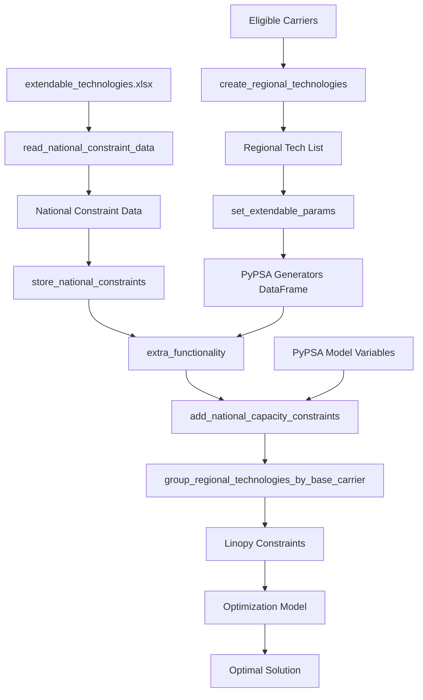

# PyPSA Regional Technology Implementation with National Constraints

## Overview

This document explains how regional disaggregation of extendable technologies with national constraints is implemented in PyPSA-RSA, specifically focusing on PyPSA's data structures, optimization model, and constraint system.

## Problem Statement

**Original Issue**: Extendable technologies are defined at the national level (single region "1") but the model runs with multiple regions (10/34/159). The original code tried to access region "10" data that doesn't exist.

**Solution**: Create regional variants of each technology with individual high limits, then enforce national constraints using PyPSA's custom constraint system.

## PyPSA Data Structure Foundation

### Generator and StorageUnit Components

PyPSA stores component data in pandas DataFrames with specific attributes:

```python
# Generator DataFrame structure
n.generators = pd.DataFrame({
    'bus': str,           # Bus connection
    'carrier': str,       # Technology type
    'p_nom': float,       # Nominal capacity [MW]
    'p_nom_extendable': bool,  # Can be optimized
    'p_nom_max': float,   # Maximum capacity limit [MW]
    'p_nom_min': float,   # Minimum capacity limit [MW]
    'build_year': int,    # Investment period
    'lifetime': float,    # Asset lifetime [years]
    'capital_cost': float, # Investment cost [€/MW]
    'marginal_cost': float, # Variable cost [€/MWh]
    # ... other attributes
})
```

### Regional Technology Naming Convention

Our implementation creates regional variants using suffixes:

```python
# Example for solar PV across 10 regions
original_carrier = "solar_pv"

# With numerical suffixes (use_regional_codes=False)
regional_variants = [
    "solar_pv_0",  # Eastern Cape (index 0)
    "solar_pv_1",  # Free State (index 1)
    "solar_pv_2",  # Gauteng (index 2)
    # ... up to solar_pv_9
]

# With regional codes (use_regional_codes=True)
regional_variants = [
    "solar_pv_EC",  # Eastern Cape
    "solar_pv_FS",  # Free State
    "solar_pv_GP",  # Gauteng
    # ... etc
]
```

## Implementation Architecture

### 1. Technology Creation Phase (`add_electricity.py`)

#### Original PyPSA Generator Creation
```python
# Standard PyPSA approach for single technology
n.add("Generator", "solar_pv_extendable",
      bus="RSA",
      carrier="solar_pv",
      p_nom_extendable=True,
      p_nom_max=50000,  # 50 GW national limit
      capital_cost=500000)  # €/MW
```

#### Our Regional Technology Creation
```python
# Our approach: Create multiple regional generators
for region_idx, bus in enumerate(n.buses.index):
    n.add("Generator", f"{bus}-solar_pv_{region_idx}-2030",
          bus=bus,
          carrier=f"solar_pv_{region_idx}",
          p_nom_extendable=True,
          p_nom_max=1e6,  # Very high individual limit
          capital_cost=500000,
          build_year=2030)
```

#### Key Implementation Function
```python
def define_extendable_tech_with_national_constraints(carriers, years, type_, ext_param):
    """
    Creates regional technology variants with high individual limits.
    National constraints applied separately in optimization phase.
    """
    
    regional_tech_list = []
    
    # Read national constraint data
    national_constraints = read_national_constraint_data(scenario_setup, years, type_)
    
    # Store for later use in constraints
    store_national_constraints(national_constraints, type_, scenario_setup)
    
    # Create regional variants
    for carrier in eligible_carriers:
        for year in years:
            for region in regions:
                suffix = get_regional_suffix(region)
                tech_id = f"{region}-{carrier}_{suffix}-{year}"
                regional_tech_list.append(tech_id)
    
    return regional_tech_list
```

### 2. PyPSA Network Building

#### Generator DataFrame Result
After our implementation, `n.generators` contains:

```python
# Example output
                          bus    carrier  p_nom_extendable  p_nom_max  build_year
Eastern Cape-solar_pv_0-2030   Eastern Cape   solar_pv_0     True      1000000      2030
Free State-solar_pv_1-2030     Free State     solar_pv_1     True      1000000      2030
Gauteng-solar_pv_2-2030        Gauteng        solar_pv_2     True      1000000      2030
# ... etc for all regions
```

#### Individual vs. Collective Constraints
- **Individual limits**: Each regional variant has `p_nom_max = 1e6` MW (effectively unlimited)
- **National constraints**: Applied collectively across all variants during optimization

## PyPSA Optimization Model Integration

### 3. Linopy Model Creation (`prepare_and_solve_network.py`)

#### PyPSA's Optimization Variables

When PyPSA creates the optimization model, it generates Linopy variables:

```python
# PyPSA automatically creates these variables during n.optimize()
n.model.variables = {
    'Generator-p_nom': xarray.DataArray,  # Capacity variables [MW]
    'Generator-p': xarray.DataArray,      # Dispatch variables [MW]
    # ... other variables
}

# Our regional generators create variables like:
# Generator-p_nom.sel(Generator="Eastern Cape-solar_pv_0-2030")
# Generator-p_nom.sel(Generator="Free State-solar_pv_1-2030")
# etc.
```

#### Variable Structure
```python
# Generator-p_nom variable dimensions
Generator-p_nom = xarray.DataArray(
    dims=['Generator'],
    coords={
        'Generator': [
            'Eastern Cape-solar_pv_0-2030',
            'Free State-solar_pv_1-2030',
            'Gauteng-solar_pv_2-2030',
            # ... all extendable generators
        ]
    }
)
```

### 4. Custom Constraint Implementation

#### PyPSA's extra_functionality Hook

PyPSA provides the `extra_functionality` parameter in `n.optimize()` for custom constraints:

```python
def solve_network(n, sns):
    def extra_functionality(n, snapshots):
        """Called after model creation, before solving"""
        # Add our custom national constraints
        add_national_capacity_constraints(n, snapshots, scenario_setup)
        
        # Other existing constraints...
        set_operational_limits(n, snapshots, scenario_setup)
    
    n.optimize(
        snapshots=sns,
        extra_functionality=extra_functionality,
        solver_name=solver_name
    )
```

#### National Constraint Implementation

```python
def add_national_capacity_constraints(n, sns, scenario_setup):
    """
    Add national capacity constraints using PyPSA's Linopy model.
    """
    
    # Access the capacity variables
    p_nom_var = n.model.variables['Generator-p_nom']
    
    # Group regional technologies by base carrier
    carrier_groups = group_regional_technologies_by_base_carrier(n.generators)
    
    # For each carrier (e.g., solar_pv)
    for base_carrier, regional_generators in carrier_groups.items():
        
        # Get national limit from stored constraint data
        national_limit = get_national_limit(base_carrier, scenario_setup)
        
        # Select regional capacity variables
        regional_capacities = p_nom_var.sel(Generator=regional_generators)
        
        # Sum across all regions
        total_capacity = regional_capacities.sum('Generator')
        
        # Add constraint: sum(all regional variants) ≤ national_limit
        n.model.add_constraints(
            total_capacity, "<=", national_limit,
            name=f"national_max_{base_carrier}"
        )
```

#### Constraint Types Implementation

Our system supports multiple constraint types from the Excel file:

```python
def add_carrier_national_constraint(n, p_nom_var, component_list, constraint_data, 
                                  constraint_type, carrier, component_type):
    """
    Add specific constraint type for a carrier.
    """
    
    # Select relevant regional components
    components_var = p_nom_var.sel(Generator=component_list)
    sum_var = components_var.sum("Generator")
    
    if constraint_type == "max_total":
        # Total installed capacity constraint
        n.model.add_constraints(
            sum_var, "<=", limit,
            name=f"national_max_total_{carrier}_{year}"
        )
    
    elif constraint_type == "min_total":
        # Minimum total capacity constraint
        n.model.add_constraints(
            sum_var, ">=", limit,
            name=f"national_min_total_{carrier}_{year}"
        )
    
    elif constraint_type == "max_annual":
        # Maximum annual new capacity
        # Would need to track new capacity in specific year
        new_capacity_in_year = get_new_capacity_variables(n, component_list, year)
        n.model.add_constraints(
            new_capacity_in_year, "<=", limit,
            name=f"national_max_annual_{carrier}_{year}"
        )
```

## Multi-Investment Period Handling

### Investment Period Structure

For multi-investment models, PyPSA uses multi-index snapshots:

```python
# Multi-investment snapshots
n.snapshots = pd.MultiIndex.from_arrays([
    [2030, 2030, ..., 2040, 2040, ...],  # Investment periods
    [datetime1, datetime2, ...]           # Time snapshots
])

# Investment periods
n.investment_periods = [2030, 2040, 2050]
```

### Period-Specific Constraints

```python
def add_multi_period_constraints(n, carrier_groups, constraint_data):
    """
    Add constraints for each investment period.
    """
    
    for year in n.investment_periods:
        if year in constraint_data.columns:
            limit = constraint_data[year]
            
            # Get components active in this period
            active_components = n.get_active_assets('Generator', year)
            period_components = [c for c in component_list if c in active_components]
            
            # Add constraint for this period
            if period_components:
                period_capacities = p_nom_var.sel(Generator=period_components)
                total_period_capacity = period_capacities.sum('Generator')
                
                n.model.add_constraints(
                    total_period_capacity, "<=", limit,
                    name=f"national_max_{carrier}_{year}"
                )
```

## Data Flow Diagram



## Example: Complete Solar PV Implementation

### Input Data (Excel)
```
extendable_technologies.xlsx - max_total_installed sheet:
extendable_max_total | regions | type      | carrier  | 2030 | 2040
CNS_LC2             | 1       | Generator | solar_pv | 50000| 80000
```

### Generated PyPSA Components
```python
# 10 regional generators created
generators = [
    "Eastern Cape-solar_pv_0-2030",   # p_nom_max = 1e6
    "Free State-solar_pv_1-2030",     # p_nom_max = 1e6
    "Gauteng-solar_pv_2-2030",        # p_nom_max = 1e6
    # ... 7 more regions
]
```

### Optimization Variables
```python
# PyPSA creates capacity variables
solar_pv_capacities = [
    Generator-p_nom["Eastern Cape-solar_pv_0-2030"],
    Generator-p_nom["Free State-solar_pv_1-2030"],
    Generator-p_nom["Gauteng-solar_pv_2-2030"],
    # ... etc
]
```

### Constraints Added
```python
# National constraint
sum(solar_pv_capacities) ≤ 50000  # 2030 limit
sum(solar_pv_capacities) ≤ 80000  # 2040 limit

# Individual constraints (set very high)
solar_pv_capacities[i] ≤ 1e6  # for each i
```

### Optimization Result
The solver might choose:
- Northern Cape: 25,000 MW (high solar resource)
- Western Cape: 15,000 MW (good resource + demand)
- Free State: 8,000 MW (good resource)
- Eastern Cape: 2,000 MW (moderate resource)
- Other regions: 0 MW
- **Total: 50,000 MW** (respects national constraint)

## Benefits of This Implementation

### 1. **Flexibility**
- Optimizer chooses optimal regional distribution
- No need to pre-define regional allocation factors
- Accounts for transmission costs, resource quality, demand location

### 2. **Maintainability**
- National data stays in single Excel file
- No complex disaggregation algorithms
- Easy to update national targets

### 3. **PyPSA Integration**
- Uses PyPSA's standard component structure
- Leverages Linopy's efficient constraint handling
- Compatible with multi-investment optimization

### 4. **Realism**
- Reflects real-world planning (national targets, regional optimization)
- Allows for transmission-constrained solutions
- Considers regional cost differences

## Configuration Options

### Regional Naming
```yaml
electricity:
  use_regional_codes: false  # _0, _1, _2 vs _EC, _FS, _GP
```

### Constraint Types Supported
- `max_total_installed`: Maximum cumulative capacity
- `min_total_installed`: Minimum cumulative capacity  
- `max_annual_installed`: Maximum new capacity per year
- `min_annual_installed`: Minimum new capacity per year

This implementation provides a robust, flexible framework for handling national technology constraints in multi-regional PyPSA models while maintaining the efficiency and structure of PyPSA's optimization approach.